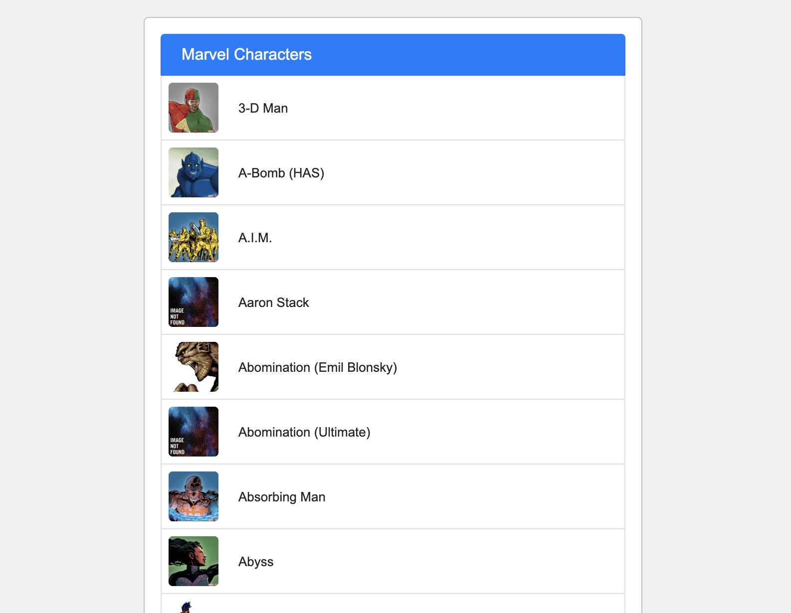
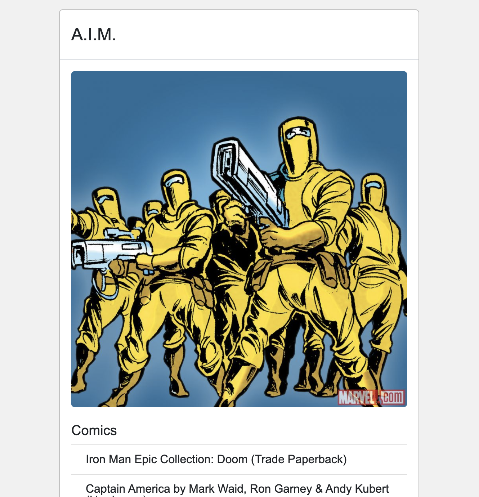

# Marvel

For install packages "yarn install" or "npm install"

For run app "yarn start" or "npm run start"

# Task:

<h2>React Dev. Coding Challenge</h2>

<a href="https://developer.marvel.com">https://developer.marvel.com</a> adresinde detaylarına ulaşabileceğin API `yi kullanarak bir
react uygulaması geliştirmeni bekliyoruz. Tercih ettiğin bir UI kütüphanesini kullanabilir yine
tercih ettiğin bir state manager kullanabilirsin.

 

Bu uygulamadan beklentimiz şunlar;

 
<li>Anasayfada karakterler listelenmeli. (karakterin adı ve fotoğrafı)</li>
<li>İlk açılışta 30 ve scroll ile sayfa sonuna ulaşıldığında sonraki sayfaya içeriği
gelmeli,</li>
<li>Her sonraki sayfada 30 adet olacak şekilde ilerlemeli</li>
<li>Karakterlerin üzerine tıklandığında ise detay sayfasına gitmeli ve bu sayfada
karakterin ( adı, fotoğrafı, açıklaması (description), ve yer aldığı çizgi romanları
(comics) ) listelenmeli.</li>
<li>Detay sayfasında listelenen karakterin yer aldığı çizgi romanlar 2005 yılından
sonra yayınlanmış olmalı ve yayınlanma tarihi yeniden eskiye doğru sıralanmalı.
Son 10 çizgi roman ile limitlendirilmeli.</li>
<li>Karakter detay sayfasında bir geri butonu / ikonu yer alamlı ve bu tıklandığında
anasayfaya gitmeli</li>
 

Artı puan katacak şeyler;

 
<li>Unit test, snapshot test</li>

Home Page

Details Page

